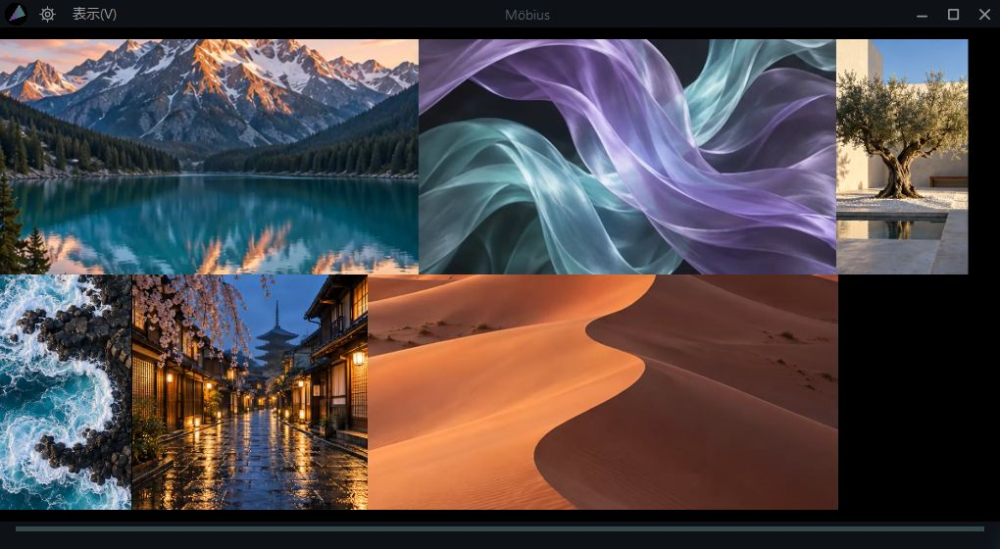
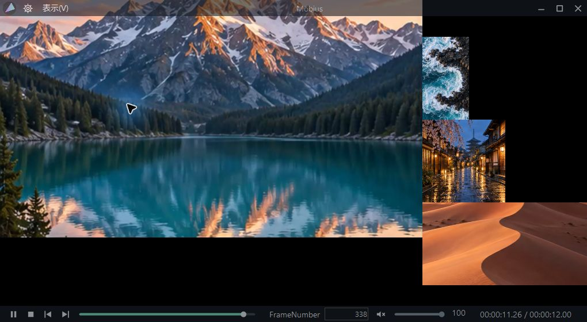

# Möbius

[English](#english) · [日本語](#日本語)

## English

Möbius is a Windows video preview app for viewing and playing multiple videos in one window. It preserves each video's aspect ratio and lets you enlarge a clip with a click or scroll horizontally through your footage.



Compare videos with different aspect ratios in a single view.

<details>
<summary>See the enlarged video view</summary>



Click a video to enlarge it in place while the other videos become smaller. Use the bottom controls to seek, enter a frame number or adjust the volume.

</details>

These screenshots were captured from the actual Möbius 0.8.3 application. The UI is real; the landscapes and other video content are AI-generated demo media. See [how the images were made](docs/images/README.md).

### Download and installation

**[Download Möbius for free](https://github.com/masatakap/M-bius/releases/latest/download/Mobius-Setup.exe)**

The source repository currently contains the development version 0.8.3. The download link above will become available after the first installer is published to GitHub Releases. Check [Releases](https://github.com/masatakap/M-bius/releases) for availability.

Once a release is available, download and run `Mobius-Setup.exe`. The installer supports Japanese, English, Spanish, French, Portuguese and Simplified Chinese. It installs for the current Windows user and adds a Start menu entry. A separate .NET installation is not required. Close Möbius before running a newer installer to update it.

To change the app's display language, open the gear menu → Settings → Language. The app language is independent of the installer language.

A public-facing website is planned using Adobe Portfolio. Its download button will use the fixed URL above.

### Features

- Arrange multiple videos while preserving their original aspect ratios, with adjustable video size and spacing.
- Composite videos into one GPU rendering surface. Use hardware decoding where supported by the format and system.
- Enlarge a video in place, scroll horizontally with inertia, repeat the layout and enable automatic scrolling.
- Choose click-to-play, play all visible videos or play on hover. Offscreen videos are paused.
- Seek, adjust volume, play, stop, step through frames and enter a FrameNumber in single-video or enlarged views.
- Use automatically hiding translucent controls and fullscreen mode; toggle file information and outlines.
- Open a video's original location or copy the file from its context menu.
- Use the app in Japanese, English, Spanish, French, Portuguese or Simplified Chinese.

Supported file extensions include MP4, MOV, Hap, AVI, MKV and MXF. Actual playback depends on the codecs inside the file and your GPU; an extension alone does not guarantee compatibility. Sony X-OCN is not supported.

FrameNumber uses zero-based numbering. Enter a number and press Enter to seek to that position and pause. Positions are calculated from the file's reported frame rate, so they may not match exact sequential frame numbers in variable-frame-rate footage.

### System requirements

- Windows 10 / 11, x64.
- A GPU with an OpenGL driver. Support for Hap compressed texture formats depends on the GPU and driver.
- CPU, memory and GPU requirements vary with the number of simultaneous videos, resolution and codecs. Guaranteed minimum hardware specifications have not yet been established.
- Most current hardware testing has been performed on an NVIDIA GeForce RTX 4070 Ti. This is not a compatibility guarantee for AMD or Intel GPUs.

See the [user guide](docs/USER-GUIDE.md), [test results](docs/TEST-RESULTS-0.8.3.md) and [changelog](CHANGELOG.md) for details. These documents are currently primarily in Japanese.

### Build from source

Use Windows and the .NET 9 SDK. The existing `source/`, `tests/` and `installer/` directory structure is preserved.

```powershell
dotnet publish source/VideoMosaic.csproj -c Release -r win-x64 --self-contained true -p:PublishReadyToRun=true -p:PublishSingleFile=false -p:DebugType=None -o app
dotnet run --project tests/LayoutTests.csproj -c Release
```

These commands build the application and run the standalone tests. Playback also requires libmpv, FFmpeg shared DLLs and the native Hap reader DLL. Native DLLs are not committed to this repository. See the [build instructions](docs/BUILD.md) for dependency sources, placement and native compilation steps.

To build the application and the installer from an already prepared native runtime directory:

```powershell
./scripts/Build.ps1 -NativeRuntimeDirectory ./runtime -Compiler 'C:/Program Files (x86)/Inno Setup 6/ISCC.exe'
```

Outputs are written to `app/` and `dist/Mobius-Setup.exe`. The build scripts do not install the app, create tags, push commits or publish releases. See the [release guide](docs/RELEASING.md) for the publishing process and plans for future automation.

### License and branding

Möbius original source code, tests and build scripts are published under the **[MIT License](LICENSE)**. Modification, redistribution and commercial use, including sales, are permitted subject to preserving the copyright and permission notices.

**The Möbius name, logo, icons and other brand assets are not covered by the MIT License.** Their use requires separate permission from the project owner. See [TRADEMARKS.md](TRADEMARKS.md).

Third-party libraries and translation files retain their own licenses. The MIT License does not relicense the entire binary distribution, including libmpv. The current native dependencies include GPL/LGPL libraries; corresponding sources and dependency license notices must be prepared before publicly distributing the installer. See [THIRD-PARTY.md](THIRD-PARTY.md) for the current status.

### Report an issue

Open a [GitHub Issue](https://github.com/masatakap/M-bius/issues) with the Möbius version, Windows version, GPU, reproduction steps and the video's format and codec.

Do not post confidential footage, personal information or credentials in public issues or logs. Where possible, use synthetic media that reproduces the problem.

---

## 日本語

複数の動画を一つの画面に並べて再生・確認できる、Windows向け動画プレビューアプリです。素材の縦横比を保った配置、クリックでの拡大、横スクロールで、多数の動画を見比べられます。


横長・縦長・正方形など、異なる縦横比の動画を一つの画面に並べて確認できます。

<details>
<summary>動画をクリックして拡大した画面を見る</summary>


動画をクリックするとその場で拡大し、ほかの動画を縮小表示します。下部の操作バーからシーク、FrameNumber入力、音量調整ができます。

</details>

画像はMöbius 0.8.3を実際に起動して撮影したものです。UIは実際のアプリの表示で、動画内の風景などにはAI生成のデモ素材を使用しています。[画像の作成について](docs/images/README.md)

### ダウンロードとインストール

**[Möbiusを無料ダウンロード](https://github.com/masatakap/M-bius/releases/latest/download/Mobius-Setup.exe)**

現在はソースコード公開の準備版（アプリ0.8.3）です。GitHub Releasesへの最初の配布登録が完了するまで、上のダウンロードリンクは利用できません。公開状況は[Releases](https://github.com/masatakap/M-bius/releases)で確認してください。

公開後は `Mobius-Setup.exe` をダウンロードして実行します。インストーラーは日本語、英語、スペイン語、フランス語、ポルトガル語、中国語（簡体字）から選択できます。現在のユーザー用にインストールし、スタートメニューへ追加します。.NETの別途インストールは不要です。更新時はMöbiusを終了してから新しいインストーラーを実行してください。

アプリ本体の言語は、起動後に歯車 → 設定 → 言語で変更できます。インストーラーの言語設定とは独立しています。

一般ユーザー向け公式サイトはAdobe Portfolioで公開予定です。サイトのダウンロードボタンには、上記の固定URLを使用します。

### 主な機能

- 元の縦横比を維持した複数動画の配置、映像サイズと余白の調整。
- GPUによる一つの描画面への合成。対応する動画・環境ではハードウェアデコードを使用。
- クリックでその場から拡大、慣性付き横スクロール、繰り返し表示と自動スクロール。
- クリック再生、表示中の全動画再生、マウスオーバー再生の切り替え。画面外の動画は停止。
- 1本表示／拡大表示でシーク、音量、再生・停止、コマ送り、FrameNumber入力。
- 自動で隠れる半透明操作バー、全画面表示、ファイル名・解像度・アウトラインの表示設定。
- 動画の右クリックから元の場所を開く／ファイルをコピー。
- アプリ本体も日本語・英語・スペイン語・フランス語・ポルトガル語・中国語（簡体字）に対応。

MP4、MOV、Hap、AVI、MKV、MXFなどを読み込み対象とします。実際の再生可否はコンテナ内のコーデックやGPUに依存し、拡張子だけでは保証できません。Sony X-OCNは未対応です。

FrameNumberは先頭を0として入力し、Enterで指定位置へ移動して一時停止します。ファイルのフレームレート情報から算出するため、可変フレームレート素材では厳密な通算番号と一致しない場合があります。

### 対応環境

- Windows 10 / 11、x64。
- GPUのOpenGLドライバーが必要です。Hapの圧縮テクスチャ形式の対応はGPU・ドライバーに依存します。
- 必要なCPU・メモリー・GPU性能は同時再生数、解像度、コーデックで変わります。最低性能の保証値はまだ設定していません。
- 現時点の主な実機検証はNVIDIA GeForce RTX 4070 Tiです。AMD／Intelでの動作保証を示すものではありません。

詳しい操作は[ユーザーガイド](docs/USER-GUIDE.md)、確認済みの範囲は[検証記録](docs/TEST-RESULTS-0.8.3.md)、変更点は[CHANGELOG](CHANGELOG.md)を参照してください。

### ソースコードからビルド

Windowsと.NET 9 SDKを使用します。既存の `source/`、`tests/`、`installer/` 構成を維持しています。

```powershell
dotnet publish source/VideoMosaic.csproj -c Release -r win-x64 --self-contained true -p:PublishReadyToRun=true -p:PublishSingleFile=false -p:DebugType=None -o app
dotnet run --project tests/LayoutTests.csproj -c Release
```

このコマンドでアプリ本体をビルドできます。再生には別途libmpv、FFmpeg共有DLL、Hap読み取りDLLが必要です。ネイティブDLLはGit管理しません。[ビルド手順](docs/BUILD.md)で入手元・配置・Hap部のコンパイル手順を確認してください。

準備済みのネイティブDLLから、本体と固定名のインストーラーを作る例：

```powershell
./scripts/Build.ps1 -NativeRuntimeDirectory ./runtime -Compiler 'C:/Program Files (x86)/Inno Setup 6/ISCC.exe'
```

生成先は `app/` と `dist/Mobius-Setup.exe` です。ビルドスクリプトはインストール、タグ作成、push、Release公開を行いません。公開手順と将来の自動化方針は[リリース手順](docs/RELEASING.md)を参照してください。

### ライセンスとブランド

Möbius独自のソースコード・テスト・ビルドスクリプトは **[MIT License](LICENSE)** で公開します。著作権表示と許諾表示を保持する条件で、改変、再配布、販売を含む商用利用が可能です。

**Möbiusの名称、ロゴ、アイコン、その他ブランド資産はMIT Licenseの対象外です。** 使用には所有者の別途許可が必要です。[TRADEMARKS.md](TRADEMARKS.md)を参照してください。

第三者ライブラリー・翻訳ファイルにはそれぞれのライセンスが適用されます。MITの指定は、libmpvなどを含む配布物全体をMITへ変更するものではありません。現在のネイティブ依存物にはGPL/LGPLのライブラリーが含まれるため、一般公開用インストーラーの配布前に対応ソースと依存物のライセンス表示を揃える必要があります。[THIRD-PARTY.md](THIRD-PARTY.md)に現状を記載しています。

### 不具合報告

[GitHub Issues](https://github.com/masatakap/M-bius/issues)へ、Möbiusのバージョン、Windowsのバージョン、GPU、再現手順、動画の形式・コーデックを記載してください。

業務素材、個人情報、認証情報を含むログや動画は公開Issueへ投稿せず、可能であれば問題を再現できる合成素材を使用してください。
